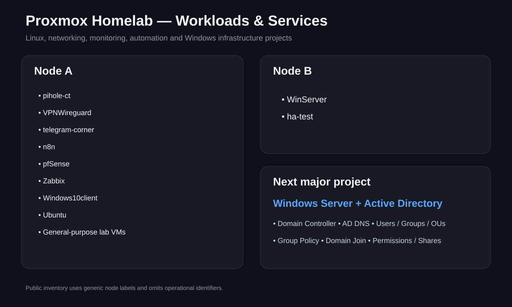
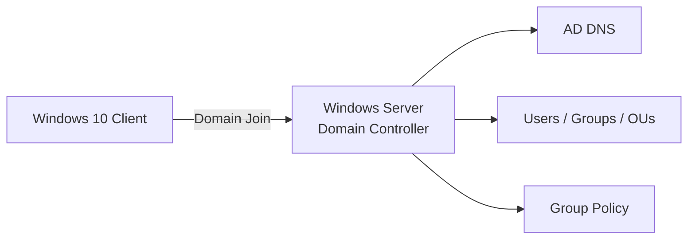
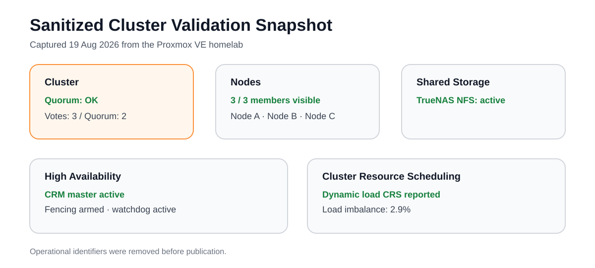
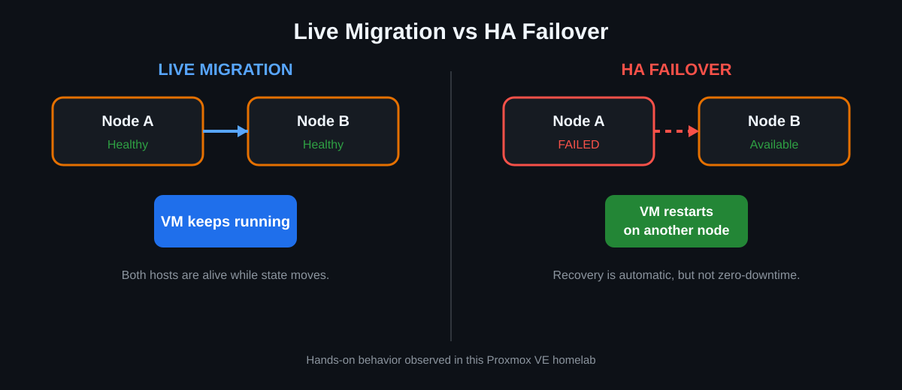

# Proxmox VE High Availability Homelab


[](https://www.linkedin.com/in/consolatomalara/)

**Author:** Consolato Malara  
**Professional profile:** [LinkedIn](https://www.linkedin.com/in/consolatomalara/)

A personal three-node Proxmox VE homelab used to learn and practice clustering, shared storage, live migration, High Availability (HA), Linux services, networking, monitoring, automation and Windows infrastructure.

<p align="center">
  
</p>

## Why this project exists

The goal is to move beyond theory and document a working learning environment with repeatable tests and real failure scenarios. This repository is a **learning portfolio**, not a production reference architecture, and it is intentionally focused on what has actually been configured, tested and observed in the lab.

## Current lab

| Component | Address | Purpose |
|---|---:|---|
| Proxmox VE Node 1 | `192.168.1.47` | Cluster node |
| Proxmox VE Node 2 | `192.168.1.48` | Cluster node |
| Proxmox VE Node 3 | `192.168.1.49` | Cluster node |
| TrueNAS | `192.168.10.76` | Shared NFS storage |

## Workloads and services

The cluster is also used as a multi-service homelab rather than only as an HA demonstration environment.

<p align="center">
  
</p>

Current workloads include:

| ID | Workload | Main purpose |
|---:|---|---|
| 107 | `n8n` | Workflow automation lab |
| 108 | `pihole-ct` | DNS filtering with Pi-hole |
| 110 | `telegram-corner` | Telegram / Python automation workload |
| 111 | `VPNWireguard` | WireGuard-based remote access to the homelab |
| 101 | `pfsense` | Firewall and network segmentation lab |
| 102 | `Homelab` | General-purpose testing |
| 103 | `Fatture` | Existing application workload |
| 104 | `Windows10client` | Windows client and future domain-join testing |
| 105 | `SMM` | Existing application workload |
| 106 | `Zabbix` | Infrastructure monitoring lab |
| 109 | `Ubuntu` | Linux testing VM |
| 100 | `WinServer` | Windows Server / next Active Directory project |
| 200 | `ha-test` | Dedicated HA and failover validation VM |

Full workload documentation: **[Workloads and Services](docs/workloads.md)**

### Key service projects

**Pi-hole** — used to practice DNS administration, client DNS configuration and network-level filtering.

**WireGuard VPN** — used to practice remote administration, peer configuration, Linux routing and firewall rules. The design goal is to manage the homelab remotely without directly publishing the Proxmox management interface to the Internet.

**Zabbix** — used as a monitoring lab for hosts, resources and services, with alerting as a future improvement.

**pfSense** — used for networking, firewall and segmentation experiments.

**n8n / Telegram automation** — Linux-hosted automation workloads used to practice application deployment and service troubleshooting.

## Next major project: Windows Server + Active Directory

The next infrastructure milestone will use `WinServer` together with `Windows10client` to build a small Microsoft domain environment.



Planned milestones:

- [ ] Install Active Directory Domain Services
- [ ] Promote `WinServer` to Domain Controller
- [ ] Configure AD-integrated DNS
- [ ] Create users, groups and Organizational Units
- [ ] Join `Windows10client` to the domain
- [ ] Configure Group Policy Objects
- [ ] Test NTFS permissions and shared folders
- [ ] Add a second Windows Server for replication testing
- [ ] Monitor the Windows environment with Zabbix
- [ ] Test backup and restore scenarios

## Real cluster snapshot

The following status card is generated from sanitized command output collected from the running lab on **19 August 2026**.

<p align="center">
  
</p>

Full evidence: **[Cluster Validation](docs/validation.md)**

## What has been tested

- [x] Three-node Proxmox VE cluster
- [x] Shared storage available to the cluster
- [x] Manual VM migration
- [x] Live migration
- [x] HA resource configuration
- [x] Physical node failure simulation
- [x] Automatic VM restart on another node
- [x] Cluster recovery after the failed node returned
- [x] Sanitized command-output validation evidence
- [x] Pi-hole service deployed
- [x] WireGuard remote-access service deployed
- [x] Zabbix monitoring lab deployed
- [x] pfSense VM prepared for networking experiments
- [ ] Active Directory domain lab
- [ ] Dedicated storage / cluster network testing
- [ ] Extended monitoring and alerting
- [ ] Backup and restore validation
- [ ] Infrastructure automation

## Key lesson: Live Migration is not HA Failover

**Live migration** moves a running VM between healthy hosts while its runtime state is transferred.

**HA failover** reacts to an unexpected host failure. Because the failed host's RAM state is no longer available, the workload must be started again on another eligible node. HA provides automatic recovery, but a sudden host failure can still cause service interruption.

<p align="center">
  
</p>

## Documentation

| Document | What it covers |
|---|---|
| [Architecture](docs/architecture.md) | Components, topology and design choices |
| [Workloads and Services](docs/workloads.md) | VM/LXC inventory, Pi-hole, VPN, monitoring and future AD lab |
| [Cluster Setup](docs/cluster-setup.md) | Three-node cluster, Corosync and quorum |
| [Shared Storage](docs/shared-storage.md) | Why shared storage matters for migration and HA |
| [High Availability](docs/high-availability.md) | Failure test, failover behavior and limitations |
| [Troubleshooting](docs/troubleshooting.md) | Problems observed and how they were interpreted |
| [Validation](docs/validation.md) | Real sanitized output showing cluster, storage and HA state |
| [Config Examples](configs/examples/README.md) | Safe examples and rules for publishing configuration |

## Validation highlights

Real command output currently confirms:

- Cluster name `labcluster`
- 3 nodes / 3 votes / quorum present
- TrueNAS NFS storage active
- HA CRM active
- Fencing armed and watchdog state visible
- HA resource `vm:200` registered on `pve2` and stopped at capture time
- `ha-manager status` reported `dynamic load CRS` with 2.9% load imbalance at capture time

Validation commands used:

```bash
pvecm status
pvecm nodes
pvesm status
ha-manager status
```

## Topics I am practicing

- Proxmox VE administration
- Linux systems administration
- Cluster concepts and quorum
- Corosync basics
- Shared storage concepts
- VM migration and live migration
- High Availability testing
- DNS / Pi-hole administration
- WireGuard VPN and remote access
- Firewall and network-lab concepts
- Zabbix monitoring
- Linux application hosting and automation
- Windows client/server fundamentals
- Failure analysis and troubleshooting
- Validation from real command output
- Technical documentation with Markdown and diagrams

## Learning and documentation note

I use AI tools as a **study and documentation assistant** to help organize notes, review explanations and improve the clarity of the Markdown documentation. The lab configurations, tests and command outputs shown here come from my own environment. I try to keep only material that I can explain and reproduce during my learning process.

## Roadmap

Planned improvements include Active Directory, dedicated network segmentation, Zabbix alerting, backup/recovery testing, additional HA scenarios, infrastructure automation and a future nested VMware/vCenter lab when hardware resources allow it.

---

> This is a personal learning homelab that documents my practical learning process and hands-on experiments.