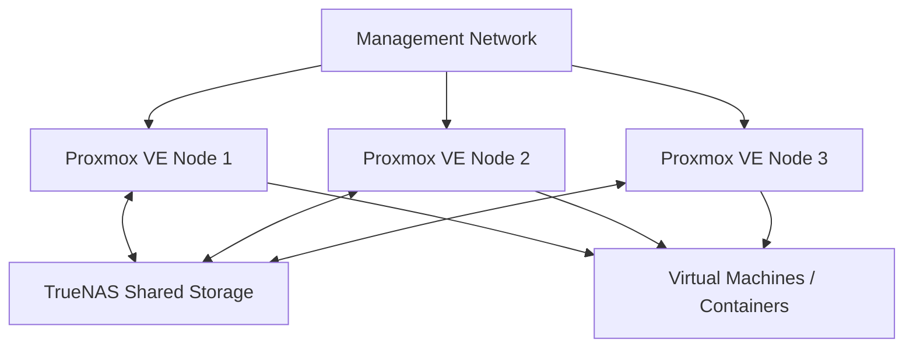

# Lab Architecture

## Overview

This homelab is designed to study virtualization, clustering, shared storage, high availability and infrastructure troubleshooting using Proxmox VE.

The environment consists of three Proxmox VE nodes connected to shared storage provided by TrueNAS.

## Architecture Diagram

## Components

### Proxmox VE Cluster

The virtualization layer consists of three Proxmox VE nodes configured as a single cluster.

The cluster allows centralized management of:

* Virtual machines
* Linux containers
* Storage
* Cluster resources
* High Availability resources

### Shared Storage

TrueNAS provides shared storage accessible by all Proxmox VE nodes.

Shared storage allows virtual machine disks to remain accessible from multiple cluster nodes.

This enables operations such as:

* VM migration
* Live migration
* HA failover
* Centralized storage management

## High Availability

Selected virtual machines can be configured as High Availability resources.

If a physical Proxmox VE node becomes unavailable, the cluster can restart the affected virtual machine on another available node.

During testing, a VM was running on one Proxmox node when that physical node was powered off.

The cluster detected the failure and automatically restarted the VM on another available node.

This demonstrated that Proxmox HA provides automatic service recovery, but does not guarantee zero downtime after an unexpected physical node failure.

## Live Migration

When both Proxmox VE nodes are operational, a running virtual machine can be migrated between nodes.

Live migration allows the VM to move between physical hosts while remaining operational.

This is different from HA failover.

During an unexpected host failure, the contents of the failed server's RAM are no longer available. The VM must therefore be restarted on another cluster node.

## Network Design

The current lab uses a management network for communication between the Proxmox VE nodes.

The current Proxmox management addresses are:

| System            | Management IP |
| ----------------- | ------------- |
| Proxmox VE Node 1 | 192.168.1.47  |
| Proxmox VE Node 2 | 192.168.1.48  |
| Proxmox VE Node 3 | 192.168.1.49  |

Shared storage is provided by:

| System  | IP Address    |
| ------- | ------------- |
| TrueNAS | 192.168.10.76 |

## Tests Performed

The following tests have been performed in the lab:

* Three-node Proxmox VE cluster creation
* Shared storage configuration
* Manual VM migration
* Live VM migration
* High Availability resource configuration
* Physical node failure simulation
* Automatic VM restart on another cluster node
* Cluster recovery after node failure

## Lessons Learned

This lab demonstrated the practical difference between live migration and High Availability.

Live migration is useful for moving a running VM between healthy physical hosts with minimal service interruption.

High Availability instead protects against physical host failure by detecting the unavailable node and restarting the affected workload on another available cluster node.

Shared storage plays an important role because the VM disks must remain accessible to the other nodes in the cluster.

## Future Improvements

Planned improvements include:

* Dedicated storage network
* Network segmentation
* VLAN testing
* Firewall isolation
* Dedicated cluster communication network
* Resource utilization monitoring
* Zabbix monitoring and alerting
* Backup and recovery testing
* Infrastructure automation
