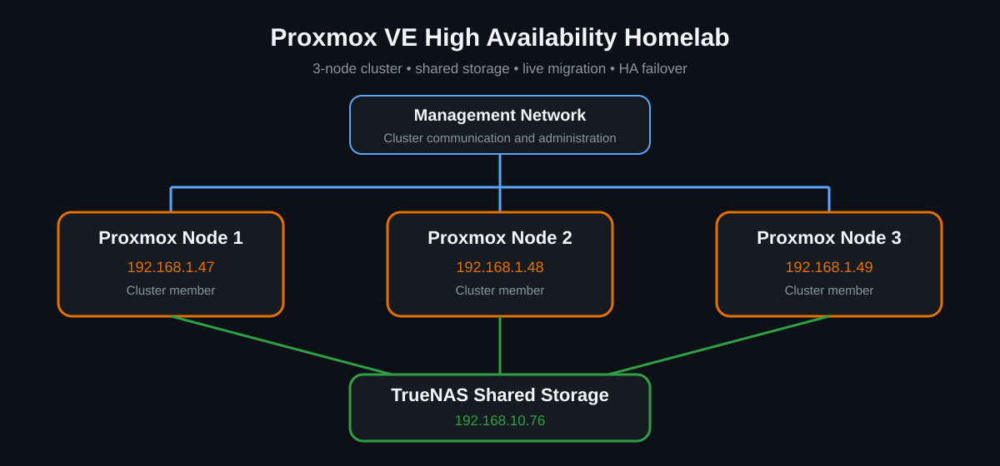
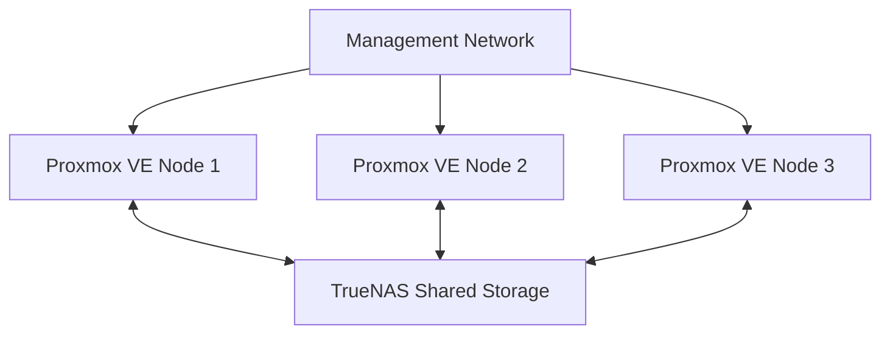

# Lab Architecture

## Overview

The homelab is built around a three-node Proxmox VE cluster with shared storage provided by TrueNAS. The design is intentionally simple enough to understand while still exposing real virtualization concepts such as quorum, migration and HA recovery.

  

## Components

| Component | Address | Role |
|---|---:|---|
| Proxmox VE Node 1 | `192.168.1.47` | Cluster node |
| Proxmox VE Node 2 | `192.168.1.48` | Cluster node |
| Proxmox VE Node 3 | `192.168.1.49` | Cluster node |
| TrueNAS | `192.168.10.76` | Shared storage |

## Logical topology

## Cluster layer

The three Proxmox VE hosts participate in the same cluster. This provides centralized management and enables cluster-aware operations such as migration and High Availability.

Corosync is used for cluster communication and membership. Quorum helps prevent unsafe decisions when nodes cannot all communicate with one another.

## Storage layer

TrueNAS provides storage reachable by multiple Proxmox nodes. This matters because a VM disk on shared storage can remain available even when the workload moves to another physical host.

See [Shared Storage](shared-storage.md) for the practical migration implications.

## High Availability

A VM was configured as an HA resource and tested by powering off the physical node on which it was running. The cluster detected the failure and restarted the VM on another available node.

This is recovery, not seamless continuation of the failed host's RAM state.

See [High Availability Testing](high-availability.md).

## Live migration

When both source and destination hosts are healthy, a running VM can be migrated between nodes. With the VM disk already on shared storage, this avoids copying the whole disk as part of the migration.

## Current network design

The current lab uses the management network for the Proxmox nodes. A future improvement is to separate traffic by purpose, for example:

- Management
- Cluster communication
- Storage
- VM / service traffic

That future state is documented as a roadmap item, not as something already implemented.

## Validated scenarios

- [x] Three-node cluster
- [x] Shared storage
- [x] Manual migration
- [x] Live migration
- [x] HA resource configuration
- [x] Physical node failure
- [x] Automatic workload restart
- [x] Node rejoin after failure

## Related documentation

- [Cluster Setup](cluster-setup.md)
- [Shared Storage](shared-storage.md)
- [High Availability](high-availability.md)
- [Troubleshooting](troubleshooting.md)
- [Validation](validation.md)
