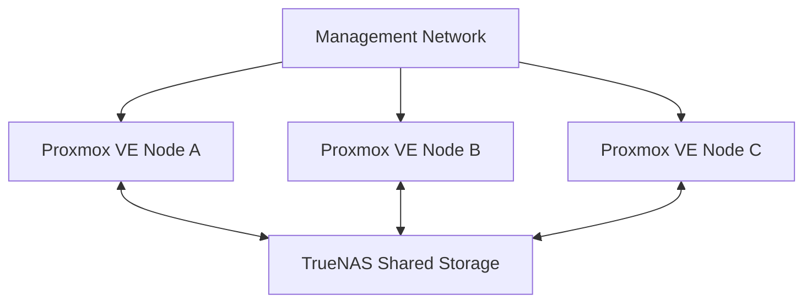
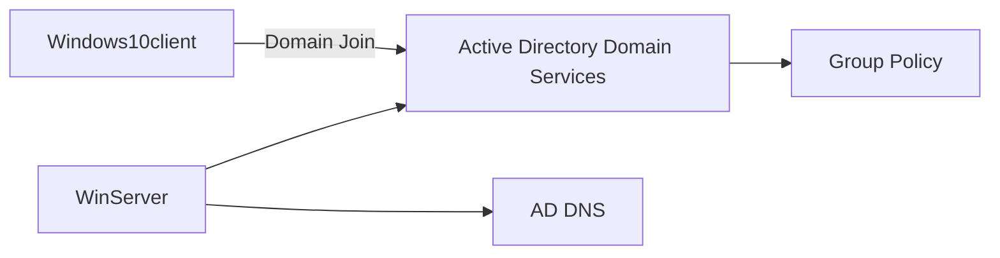

# Lab Architecture

## Overview

The homelab is built around a three-node Proxmox VE cluster with shared storage provided by TrueNAS. The design is intentionally simple enough to understand while still exposing real virtualization concepts such as quorum, migration, shared storage and HA recovery.

  

## Components

| Component | Role |
|---|---|
| Proxmox VE Node A | Cluster node |
| Proxmox VE Node B | Cluster node |
| Proxmox VE Node C | Cluster node |
| TrueNAS | Shared NFS storage |

> Real IP addresses and hostnames are intentionally omitted from the public repository.

## Logical topology

## Workload layer

The Proxmox cluster hosts a mix of Linux containers, virtual machines, infrastructure services and test workloads.

  

Important services include:

- `pihole-ct` for DNS filtering and DNS administration practice
- `VPNWireguard` for secure remote access to the homelab
- `Zabbix` for infrastructure monitoring
- `pfsense` for firewall and segmentation experiments
- `telegram-corner` for Linux-hosted Python / Telegram automation
- `n8n` for workflow automation experiments
- `ha-test` as a dedicated HA validation VM
- `WinServer` and `Windows10client` for the upcoming Microsoft Active Directory lab

The full inventory is documented in [Workloads and Services](workloads.md).

## Cluster layer

The three Proxmox VE hosts participate in the same cluster. This provides centralized management and enables cluster-aware operations such as migration and High Availability.

Corosync is used for cluster communication and membership. Quorum helps prevent unsafe decisions when nodes cannot all communicate with one another.

## Storage layer

TrueNAS provides storage reachable by multiple Proxmox nodes.

The storage design currently uses:

- **3 disks in a ZFS RAIDZ1 vdev**
- **1 additional disk configured as a spare**
- a **dedicated dataset for Proxmox**
- an **NFS share** exported from that dataset
- Proxmox configured to use that NFS export as **shared cluster storage**

This matters because a VM disk on shared storage can remain available even when the workload moves to another physical host.

RAIDZ1 provides single-parity protection for the three-disk vdev. The separate spare is available as replacement capacity; it is not a second parity disk and does not make the layout equivalent to RAIDZ2.

See [Shared Storage](shared-storage.md) for the detailed storage design and migration implications.

## Remote access layer

The `VPNWireguard` container is used to access the homelab remotely.

The design goal is to administer internal systems through an encrypted VPN rather than exposing the Proxmox management interface directly to the public Internet.

This part of the lab covers:

- WireGuard peer configuration
- Linux routing
- Remote access
- Firewall policy
- Network isolation and security boundaries

## Monitoring layer

The `Zabbix` VM is used to practice infrastructure monitoring. The monitoring roadmap includes Proxmox nodes, Linux hosts, service availability, storage usage and alerting.

Pi-hole also provides a practical DNS service that can be monitored as part of the same environment.

## High Availability

A VM was configured as an HA resource and tested by powering off the physical node on which it was running. The cluster detected the failure and restarted the VM on another available node.

This is recovery, not seamless continuation of the failed host's RAM state.

See [High Availability Testing](high-availability.md).

## Live migration

When both source and destination hosts are healthy, a running VM can be migrated between nodes. With the VM disk already on shared storage, this avoids copying the whole disk as part of the migration.

## Current network design

The current lab uses a management network for the Proxmox nodes. A future improvement is to separate traffic by purpose, for example:

- Management
- Cluster communication
- Storage
- VM / service traffic

That future state is documented as a roadmap item, not as something already implemented.

## Cloud practice

Separate from the local homelab, I also have hands-on experience with **AWS EC2** and **Security Groups**, including running Linux workloads and controlling inbound/outbound access rules.

## Upcoming Windows infrastructure layer

The next major project is a Windows domain lab based on `WinServer` and `Windows10client`.

Planned work includes Active Directory Domain Services, users and groups, Organizational Units, Group Policy, DNS, domain join, permissions, shared folders, replication and monitoring.

## Validated scenarios

- [x] Three-node cluster
- [x] Shared NFS storage
- [x] TrueNAS dataset dedicated to Proxmox
- [x] ZFS RAIDZ1 layout with separate spare documented
- [x] Manual migration
- [x] Live migration
- [x] HA resource configuration
- [x] Physical node failure
- [x] Automatic workload restart
- [x] Node rejoin after failure
- [x] Pi-hole service deployed
- [x] WireGuard remote-access service deployed
- [x] Zabbix monitoring workload deployed
- [x] AWS EC2 and Security Groups practice
- [ ] Controlled storage-disk replacement test
- [ ] Active Directory domain environment
- [ ] Segmented network architecture

## Related documentation

- [Workloads and Services](workloads.md)
- [Cluster Setup](cluster-setup.md)
- [Shared Storage](shared-storage.md)
- [High Availability](high-availability.md)
- [Troubleshooting](troubleshooting.md)
- [Validation](validation.md)
