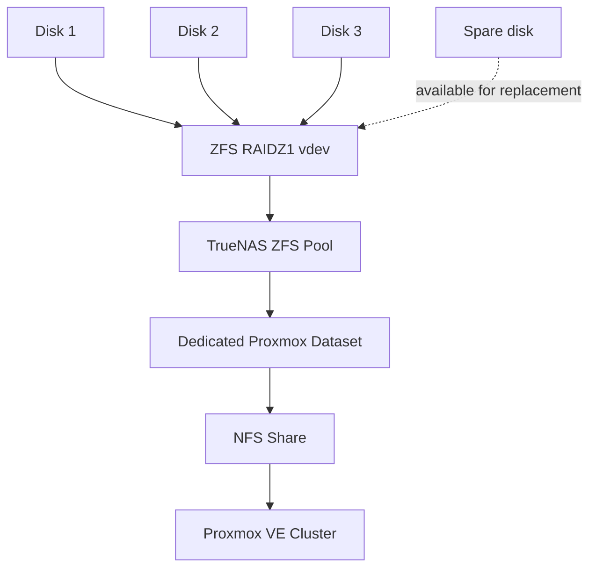

# Shared Storage with TrueNAS

## Role in the lab

TrueNAS provides the shared storage used by the three-node Proxmox VE cluster. The goal is to keep VM disks accessible from multiple Proxmox hosts so that migration and HA recovery do not depend on the local disk of a single node.

<p align="center">
  
</p>

## Current TrueNAS layout

The storage pool used for the Proxmox lab is configured with:

- **3 disks in a RAIDZ1 vdev**
- **1 additional disk configured as a spare**
- a **dedicated dataset for Proxmox storage**
- the dataset exported to Proxmox through **NFS**
- the NFS storage added as **shared storage** and made available to the cluster nodes



## Why RAIDZ1 + spare

RAIDZ1 provides single-parity protection for the three-disk vdev, so the vdev can tolerate the failure of one member disk.

The additional spare is **not extra parity** and does not turn RAIDZ1 into RAIDZ2. Its purpose is to provide a replacement disk that can be used when a pool member fails, reducing the time needed to restore the intended disk layout.

This configuration was chosen for a personal learning lab where the objectives include understanding ZFS, redundancy, shared storage and recovery behavior. It is not presented as a universal production recommendation.

## Dataset and NFS layer

A dedicated TrueNAS dataset is used for Proxmox rather than mixing the virtualization workload with unrelated data.

The dataset is exported over NFS and then added to Proxmox as shared storage. This separation makes the design easier to understand and allows storage settings to be managed specifically for the virtualization lab.

## Why shared storage matters

Shared storage is important for this homelab because it supports:

- VM migration between cluster nodes
- faster live migration when the virtual disk does not need to be recopied
- HA recovery because another node can access the same VM disk
- centralized storage management
- practical study of ZFS, NFS and virtualization storage concepts

## Practical observation

A migration involving local disk storage took noticeably longer because disk data had to be transferred between hosts. Once the VM used shared NFS storage, migration was much faster because the virtual disk was already reachable from the destination host.

That distinction is important: **cluster membership alone does not make storage shared**.

## Validation

From a Proxmox node:

```bash
pvesm status
```

The sanitized validation snapshot confirms that the TrueNAS NFS storage was active at capture time.

## Failure and recovery concepts

The storage design also helps me practice several concepts:

- ZFS pool health
- RAIDZ1 parity
- degraded pool state
- replacement / resilver concepts
- spare-disk purpose
- NFS availability
- impact of storage availability on VM migration and HA

A future lab improvement is to perform and document a controlled disk-failure / replacement test without risking important data.

## Design considerations

The current lab is intentionally simple. Future improvements may include:

- a dedicated storage network
- storage performance and latency measurements
- ZFS health monitoring
- controlled disk replacement testing
- NFS outage testing
- backup and restore validation

## Security note

The public repository does not include:

- storage IP addresses
- NFS export paths that are not needed for explanation
- usernames or passwords
- SSH or WireGuard keys
- authentication secrets or API tokens
- public endpoints
- sensitive storage configuration
