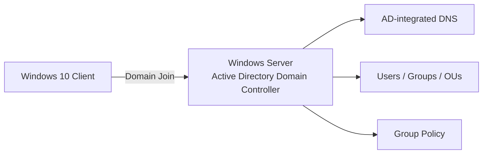

# Workloads and Services

This page documents the virtual machines and containers currently visible in the Proxmox VE homelab, together with the purpose of the services that are already part of the environment and the next planned projects.

  

> The inventory below is a point-in-time view of the lab. Runtime state can change as workloads are started, stopped, migrated or used for testing.

## Current workload inventory

### Node `proxmox`

| ID | Name | Type | Role / purpose |
|---:|---|---|---|
| 107 | `n8n` | LXC container | Workflow automation lab |
| 108 | `pihole-ct` | LXC container | DNS filtering / Pi-hole service |
| 110 | `telegram-corner` | LXC container | Telegram automation / bot workload |
| 111 | `VPNWireguard` | LXC container | WireGuard VPN for secure remote access to the homelab |
| 101 | `pfsense` | Virtual machine | Firewall and network segmentation lab |
| 102 | `Homelab` | Virtual machine | General-purpose lab workload |
| 103 | `Fatture` | Virtual machine | Existing application workload; detailed role to be documented later |
| 104 | `Windows10client` | Virtual machine | Windows client testing |
| 105 | `SMM` | Virtual machine | Existing application workload; detailed role to be documented later |
| 106 | `Zabbix` | Virtual machine | Infrastructure monitoring lab |
| 109 | `Ubuntu` | Ubuntu workload | Linux testing / general-purpose lab workload |

### Node `pve2`

| ID | Name | Type | Role / purpose |
|---:|---|---|---|
| 100 | `WinServer` | Virtual machine | Windows Server lab; next milestone is Active Directory |
| 200 | `ha-test` | Virtual machine | Dedicated Proxmox HA and failover test workload |

### Node `pve3`

No permanent workload is being documented on this node at the moment. It remains available as a cluster member for migration, HA testing and future workload placement.

## Services already implemented

### Pi-hole DNS filtering

`pihole-ct` is used to practice DNS administration and network-level filtering inside the lab.

Topics covered or planned around this service include:

- DNS resolution
- Local DNS behavior
- Client DNS configuration
- Filtering and block lists
- Service availability monitoring

### WireGuard remote-access VPN

`VPNWireguard` provides remote access to the homelab.

The VPN project is especially relevant because it combines several infrastructure topics:

- Linux networking
- WireGuard peer configuration
- Routing
- Firewall rules
- Remote administration
- Security boundaries between the lab and other networks

The objective is to manage the Proxmox environment remotely without exposing the Proxmox management interface directly to the public Internet.

### Zabbix monitoring

`Zabbix` is used as the monitoring platform for Linux and infrastructure services.

The monitoring roadmap includes:

- Host availability
- CPU and memory usage
- Storage usage
- Network monitoring
- Service monitoring
- Alerting
- Proxmox node monitoring

### Telegram automation

`telegram-corner` hosts Telegram automation used in personal lab projects. It provides practical experience with Linux services, Python applications, service management and troubleshooting.

### n8n automation

The `n8n` container is intended for workflow automation experiments and future infrastructure integrations.

### pfSense networking lab

The `pfsense` VM is part of the networking and security roadmap. Planned use includes firewall policy testing, network isolation and segmentation experiments.

## Windows infrastructure project

The next major infrastructure project is based on `WinServer` and `Windows10client`.

### Planned topology

### Planned Active Directory milestones

- [ ] Install and configure Active Directory Domain Services
- [ ] Promote `WinServer` to Domain Controller
- [ ] Configure an internal AD DNS namespace
- [ ] Create Organizational Units
- [ ] Create users and security groups
- [ ] Join `Windows10client` to the domain
- [ ] Configure Group Policy Objects
- [ ] Test password and account policies
- [ ] Create shared folders and NTFS permissions
- [ ] Test DNS resolution from the domain client
- [ ] Add a second Windows Server for replication testing
- [ ] Test backup and restore of Active Directory
- [ ] Integrate Windows monitoring into Zabbix

## Future projects

Planned additions to the homelab include:

1. **Windows Server + Active Directory** — users, groups, OUs, DNS, GPO and domain clients.
2. **Network segmentation** — isolate lab services and management traffic.
3. **Monitoring expansion** — Zabbix dashboards and alerting for cluster services.
4. **Backup and disaster recovery** — restore testing for VMs and services.
5. **Infrastructure automation** — Terraform / Ansible experiments where they add real value.
6. **VMware nested lab** — future comparison with vSphere / vCenter concepts when hardware resources allow it.

## Why this inventory matters

The homelab is not built around a single technology. It is designed as a small infrastructure environment where virtualization, Linux, Windows, networking, monitoring and automation can interact.

The goal is to document not only successful configurations, but also troubleshooting, failure scenarios and the reasoning behind infrastructure decisions.
